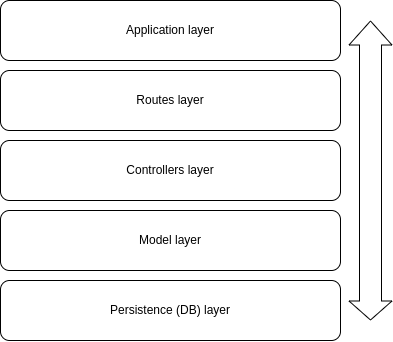
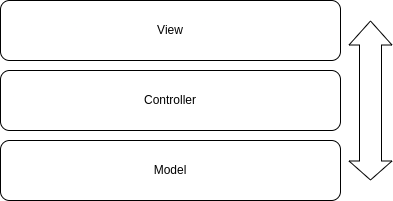

# The Software Architecture Handbook

Source: https://www.freecodecamp.org/news/an-introduction-to-software-architecture-patterns/

## Foldes Structures to know

- All in One Place Folder Structure (change to branch: `all-in-one-place-folder`)

- Layers Folder Structure (change to branch: `layers-folder-structure`)
  

- MVC Structure (change to branch: `mvc-folder-structure`)
